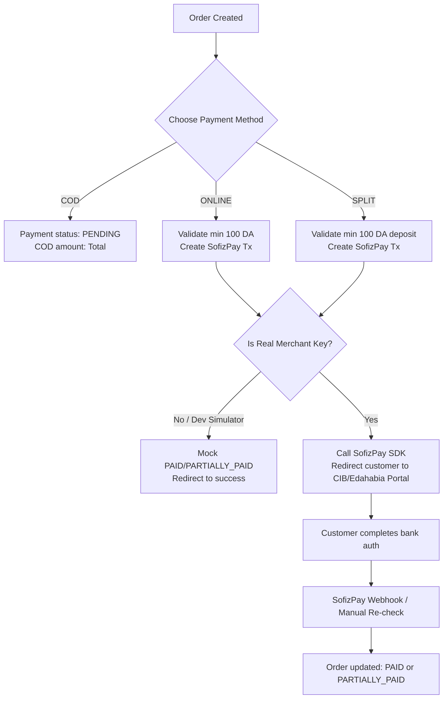

# DzDropship

A modern Next.js dropshipping platform tailored for the Algerian e-commerce market. DzDropship integrates secure online payments alongside traditional cash-on-delivery flows, enabling merchants to manage orders, track shipments, and reconcile payments seamlessly.

---

## 🌟 Key Features

*   **Order Management Dashboard**: Streamlined interface to monitor dropshipped orders from local wholesalers or international suppliers (e.g., AliExpress).
*   **Flexible Payment Methods**:
    *   **Cash on Delivery (COD)**: 100% cash collection upon delivery.
    *   **Fully Online**: Complete payment using Algerian **CIB** or **Edahabia** cards.
    *   **Split/Deposit Payment (Hybrid)**: Customers pay a security deposit online (minimum 100 DA) via card to secure the order, and pay the remaining balance as COD upon package delivery.
*   **SofizPay Integration**: Native integration with the SofizPay gateway for secure, official transaction processing.
*   **Reconciliation & Sync Engine**: Automated verification of online transaction statuses, paired with batch syncing for courier-delivered COD balances.

---

## 💳 The Payment Workflow

When an order is created, the checkout process handles payment selection through three main paths:



### Payment Verification & Fallbacks
1.  **Webhooks**: SofizPay triggers an asynchronous POST webhook to `/api/sofizpay/webhook` when a payment is captured or declined, auto-updating order status.
2.  **Polling/Manual Re-check**: If a webhook is delayed or blocked, the client interface at `/checkout/verify` polls `/api/cib-transaction-check` every 5 seconds or allows users to manually re-verify. This hits the SofizPay gateway directly via the SDK.

---

## 🛠️ SofizPay Integration & SDKs

[SofizPay](https://www.sofizpay.com) is a payment gateway provider in Algeria supporting **EDAHABIA** (Algérie Poste) and **CIB** cards. 

### 1. In-Project JS/TS SDK Usage
DzDropship uses the official **`sofizpay-sdk-js`** wrapper to communicate with the payment API. 
*   **Installation**: Defined in [package.json](file:///c:/Users/DATA%20NET/DzDropship/package.json) directly from the official repository:
    ```json
    "sofizpay-sdk-js": "github:Kenandarabeh/sofizpay-sdk"
    ```
*   **SDK Wrapper**: Located in [lib/sofizpay.ts](file:///c:/Users/DATA%20NET/DzDropship/lib/sofizpay.ts), providing the `SofizPay` client:
    *   `sofizpay.payments.create(...)`: Calls `makeCIBTransaction` with the merchant account, buyer phone, email, and amount.
    *   `sofizpay.payments.retrieve(...)`: Calls `checkCIBStatus` to fetch real-time bank response codes (e.g., mapping `respCode "00"` or `orderStatus 2` to `PAID`).

### 2. Broad SofizPay SDK Ecosystem
SofizPay maintains open-source SDKs across multiple languages and ecosystems to help developers integrate payments into diverse codebases:

*   **JavaScript & TypeScript (Node.js/React/Next.js)**: 
    *   Provides high-level promises for initiating checkout workflows and parsing bank response payloads.
*   **Python**:
    *   Ideal for Django, Flask, or FastAPI backends handling server-to-server transaction signatures.
*   **PHP**:
    *   Widely used for Laravel, Symfony, or custom CMS platforms (WooCommerce, WHMCS).
*   **Java**:
    *   Tailored for enterprise microservices and native Android app integrations.
*   **Dart & Flutter**:
    *   Enables smooth CIB/Edahabia checkout experiences within cross-platform mobile apps.

For more information and detailed API parameters, refer to the [SofizPay Developer Documentation](https://docs.sofizpay.com).

---

## 📂 Core Project Architecture

*   [lib/sofizpay.ts](file:///c:/Users/DATA%20NET/DzDropship/lib/sofizpay.ts): Initialization and abstraction wrapper over `sofizpay-sdk-js`.
*   [app/api/orders/\[id\]/checkout/route.ts](file:///c:/Users/DATA%20NET/DzDropship/app/api/orders/%5Bid%5D/checkout/route.ts): Handles order checkout initiation and redirects.
*   [app/api/cib-transaction-check/route.ts](file:///c:/Users/DATA%20NET/DzDropship/app/api/cib-transaction-check/route.ts): Verification endpoint for polling status.
*   [app/api/sofizpay/webhook/route.ts](file:///c:/Users/DATA%20NET/DzDropship/app/api/sofizpay/webhook/route.ts): Callback handler for payment notifications.
*   [app/api/sofizpay/sync/route.ts](file:///c:/Users/DATA%20NET/DzDropship/app/api/sofizpay/sync/route.ts): Sync route to reconcile card logs and COD cash deliveries.
*   [components/CheckoutSimulator.tsx](file:///c:/Users/DATA%20NET/DzDropship/components/CheckoutSimulator.tsx): Test simulator utility for offline staging.

---

## ⚙️ Configuration & Environment Variables

Create a `.env` file in the root directory and define the following variables:

```bash
# Database URL (SQLite)
DATABASE_URL="file:./dev.db"

# SofizPay Merchant configuration
# (Note: Merchant accounts starting with 'G' represent live stellar keys)
SOFIZPAY_MERCHANT_ACCOUNT="your_merchant_account_address"
```

---

## 🚀 Getting Started

### 1. Prerequisites
Ensure you have **Node.js (v18+)** and **npm** installed.

### 2. Install Dependencies
```bash
npm install
```

### 3. Database Migration
Initialize and sync your SQLite database with Prisma:
```bash
npx prisma db push
```

### 4. Run the Development Server
```bash
npm run dev
```
Open [http://localhost:3000](http://localhost:3000) in your browser to access the dashboard and checkout portal.
